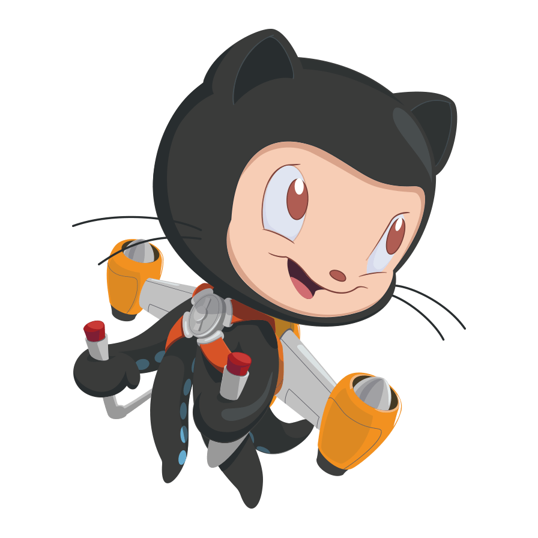

# Up and Running ​with Git and GitHub 😸

A brief introduction to Git and GitHub on how you can get started and creating your own ReadME page.

## ✨ Pre-requisites
- [Create a GitHub Account](https://aka.ms/creategithub) 
- [Download Git](https://aka.ms/downloadgit) ​
- [Download Visual Studio Code](https://aka.ms/downloadvscode) 

## 📖 Definitions 
* ``GitHub:`` Web-based platform to host your code
* ``Version Control:`` Track changes over time
* ``Git:`` Local software to save ​project snapshot
* ``Repository:`` storage for your project
* ``ReadMe:`` Contains information on file contents in a repository

## 👩🏾‍💻 Task
Add a README to your GitHub profile to tell other people about yourself.

## 🚀 Useful Links
#### GitHub Profiles 
- [GitHub Profile ReadMe and Best Practice](https://aka.ms/GHProfileReadme)
- [Emoji Cheatsheet adding Emojis and icons to your profile](https://www.webfx.com/tools/emoji-cheat-sheet/)
- [Adding Dynamically generated GitHub stats for your readmes](https://anuraghazra/github-readme-stats)
- [Managing your profile README - GitHub Docs](https://docs.github.com/en/account-and-profile/setting-up-and-managing-your-github-profile/customizing-your-profile/managing-your-profile-readme)

#### Azure and Tools for Students 
- [Student Hub](https://aka.ms/learnstudent)
- [Azure for Students](https://aka.ms/azure4student)
- [GitHub Student Developer Pack](http://aka.ms/GitHubStudentPack) 

