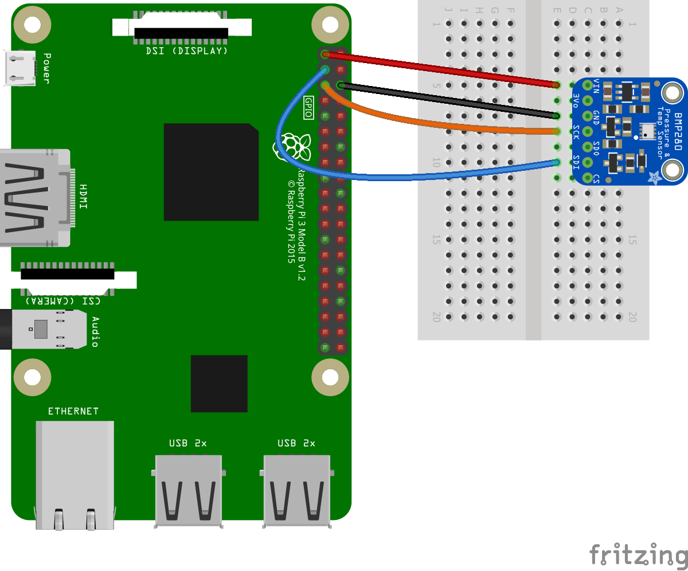
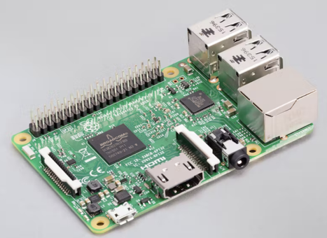
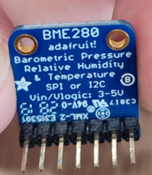
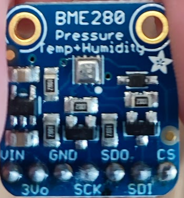
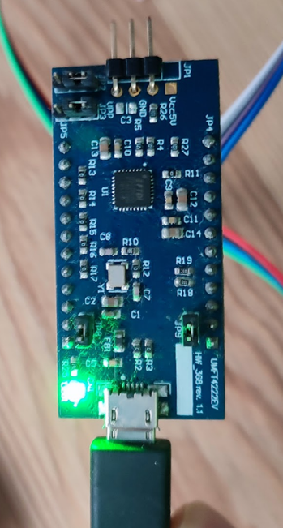
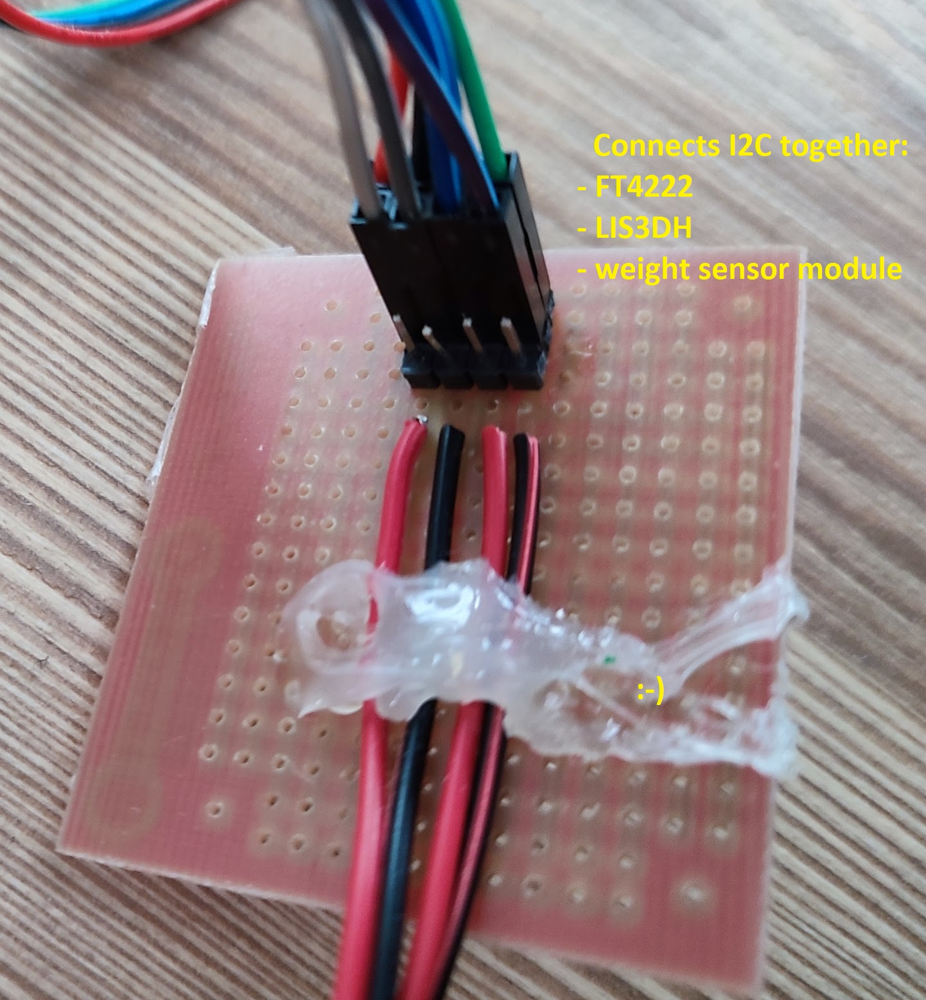
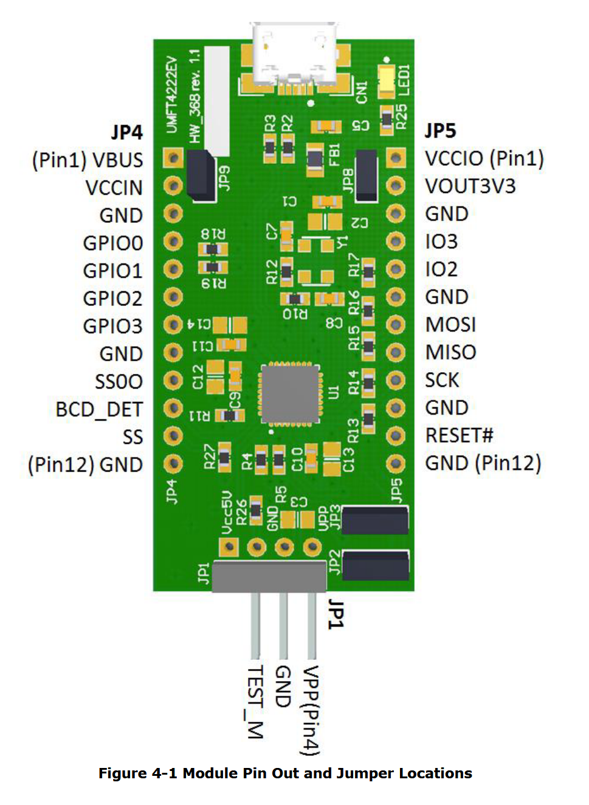
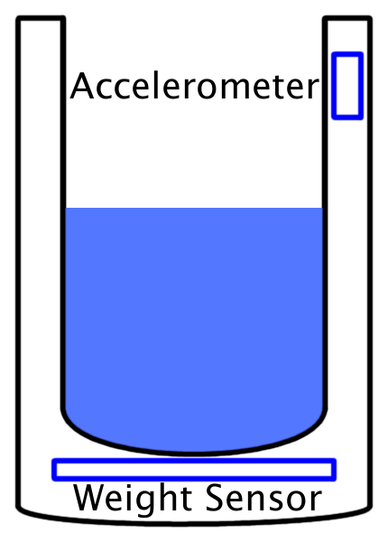
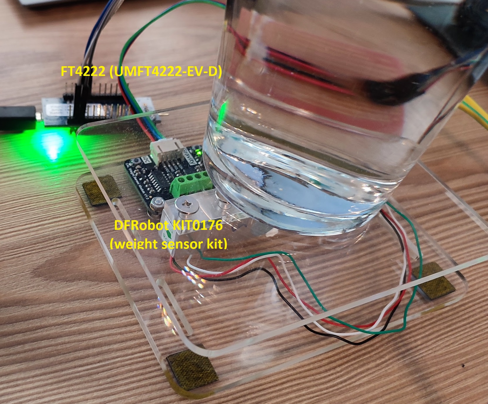

# Using IoT sensors with .NET

Let’s build prototype of smart bottle - we need to tell how much water was consumed
Where do we start? We need a sensor and something to connect it to.

## Background

You can skip if you already know this.

### How do we read from sensors

Most of the sensors communicate using different protocols. Most popular ones are:
- I<sup>2</sup>C
- SPI
- GPIO
- serial port
- PWM

In this presentation we will be using solely I<sup>2</sup>C devices. They are by my experience the most reliable ones - they are the most reliable to work with on non-real time OS.

### I<sup>2</sup>C

#### How to connect

I<sup>2</sup>C devices require two lines (or cables or connections):
- SDA - data line, it may be sometimes called SDI
- SCL - clock line, it may be sometimes called SCK

on top of that each device needs power source:
- GND - ground - sometimes marked with minus sign
- VCC - voltage collector - it has higher voltage with respect to ground, typically it's 3.3 or 5V, it may be also marked as VIN (input voltage)

It is very important to alaways connect ground (GND) first - without ground no communication will work and there is high risk of destroying component.
There may be more than one grounds on some devices - one of them will refer to communication ground and another might refer to power source ground.
You should always refer to datasheet if anything is unclear. Typically low-power devices will have single ground and high-power will have an option to supply external power.

Supply voltage is frequently shared between devices but device may also have separate power source.

While this may sound a bit intimidating typically it's just 4 cables which may be connected as following:



Physically these devices look like following:



And sensor - it's not actually BMP280 as on the picture above but its twin BME280 which has some extra capabilities:




Note the labels on the picture: VIN, GND, SCK, SDI - those are the ones you'd use for I<sup>2</sup>C communication.
This sensor also allows SPI communication therefore extra pins.

#### How do you connect it to your PC?

If you're using board with visible pins, i.e. Raspberry Pi - you need to find the datasheet (pinout specifically) and find where I<sup>2</sup>C related pins are.
If you don't have Raspberry Pi you can also use USB device which provides you such pins.
My personal favorite device for that is FT4222 - it typically is used on the development board i.e. UMFT4222EV-D which doesn't require any soldering.
This device allows to use I<sup>2</sup>C, SPI and even has couple of GPIO pins with just USB.

Here is how that looks:




That relatively large, square black component in the center with many tiny pins around is FT4222 chip.
It works on Windows, Linux and macOS! As opossed to Raspberry Pi which is best supported on Linux.

#### How do you connect more than one I<sup>2</sup>C device?

I<sup>2</sup>C is actually a bus which in simple words means we can connect communication (SDA/SCL) cables together respectively and of course the same for the power source (GND/VCC).

How does that work?

- One of the devices connected to I<sup>2</sup>C bus is a "master", which means it decides who will be talking (or listening) – in our case this is FT4222
- Remainder of devices are "slaves" – they only "talk" when they are told to – in our case those are LIS3DH (accelerometer) and weight sensor module
- Each "slave" device have an address – it's usually random and collisions are unlikely
  - Many devices allow to pick one of few addresses (i.e. having physical fuse/pin/switch to change it)
- When "master" wants to "talk" to a specific device he transmits its address first and then send commands and awaits response
- Specific way they "talk" is described by I<sup>2</sup>C protocol
  - We don't need to know or understand it – knowing it exists, learning how to connect and knowing that devices have addresses is more than enough
  - To use protocol directly we only need to know that we can write and read from the devices and know their address - still knowledge about protocol is not needed

For my setup in this demo I've made tiny board to connect those lines together - they could be soldered together as well or I could use breadboard
but it's just more convenient this way for me:


It's not prettiest but it does its job pretty well!

#### How do we find out which pins to connect where

As you've probably noticed on the pictures above some of the devices have labels on the pins.
If that's available you're in luck. On the other hand if you look at the FT4222 development board it actually doesn't have labels,
just some cryptic things like JP4, JP5.

The only way to figure out what's what is datasheet or some helpful soul on the internet. Datasheet is your best bet though.

We start with searching for datasheet or pinout (i.e. we search for "UMFT4222EV-D datasheet" or "UMFT4222EV-D pinout").
If you directly find pinout - you're in luck, if not search for it in the datasheet - it's really rare for the device to not have that in the datasheet.

You'll quickly find picture similar to this:



Ok, now we can find GND and some other random names but we still cannot find SDA. There is SCK though but given there is no SDA/SDI pin closeby we should be wary of using it.
Let's open datasheet again and search for "I2C". Hopefully you've found section which looks like this:


According to picture SCL is on JP4 pin 4, SDA is on JP4 pin 5. We can see JP4 and JP5 on the pinout picture but how do we find numbering?
That's actually simple. Usually first pin has square pad while others have round - take a closer look at the picture and you'll notice that.
Now we need to figure out if numbering starts with 0 or 1 - since VBUS is labelled as Pin 1 we can start counting from there.
On the pinout picture SCL is labelled as GPIO0 and SDA as GPIO1. Why is that? Frequently pins have multiple usages - the same pin can be used for I<sup>2</sup>C GPIO or SPI.

So we now know where to connect GND, SCL and SDA. But what about VCC?

If we look closely at pinout there are: VBUS, VCCIO, VCCIN, VOUT3V3 - it couldn't be more confusing? It's all in the datasheet but to clarify how to quickly learn without reading:
- our FT4222 development board is USB device - USB provides power so VBUS will be likely your USB power (you should verify that in the datasheet to be 100% sure)
- now VOUT3V3 - VOUT always refers to output which can be used to supply power elsewhere - 3V3 must mean 3.3V since that's one of the typical voltages used (so USB is 5V but our board gives you way to use 3.3 V)

we can analyze reminder but VOUT3V3 is what we're looking for. How do we know if we should use 3.3V or 5V? Datasheet of course - this time datasheet for device we want to connect to.
Most of the devices will work on both 3.3V and 5V and connecting less is usually safe - worst case scenario it won't work but it won't get destroyed. If you need to use 5V you can plug into USB power source (VBUS).

If in doubt always refer to datasheet.

### We now have our devices some way to connect I2C but how do we actually read from the device?

I'll cover only how to do that with .NET.

First step is to create your app - i.e. console app. You can do it in Visual Studio or with `dotnet new console` command if you have [dotnet SDK installed](https://dotnet.microsoft.com/en-us/download).

.NET provides github repository for different devices: https://github.com/dotnet/iot the output of that repository is NuGet package: [Iot.Device.Bindings](https://www.nuget.org/packages/Iot.Device.Bindings).
The list of all supported devices by this repository can be found [here](https://github.com/dotnet/iot/blob/main/src/devices/README.md).

First step is to find device you're looking for on that list and then read README page for that device.

I.e. [FT4222 README](https://github.com/dotnet/iot/blob/main/src/devices/Ft4222/README.md) will tell you how to install USB driver for that device and provide you sample code how to use it.

## Water consumption tracking with .NET IoT

Now that we have some background - lots of information if you haven't done anything similar - let's use that in practice - you will learn that more than 50% of work is connecting your device correctly and with a bit practice it's actually all very simple.

In this demo we will prototype smart bottle which will track water consumption. Let's first figure out what we might need first.

We definitely will need way to measure weight - weight sensor will work here.
It would be useful to track movement of bottle to be able to tell if bottle is picked up and if it's being leaned (drinked from) and even perhaps in the future measure steps user makes and provide them estimate on number of calories burnt (we won't do that here though).
For movement tracking accelerometer we can use accelerometer.

### Smart bottle design

Now that we know what sensors we can use let's design the bottle. Example design could look like this



Realistically designing and producing such bottle just for prototype is expensive.
We can do some shortcuts and simplifications here are proof of concept.

- We'll use glass rather than bottle and attach accelerometer with a tape - we'll use long enough cable so that picking up glass is physically possible
- For prototupe we can use weight sensor module looking like regular weight without any double bottoms etc.
- Since we want to prototype quickly we will skip any wireless transmissions and use FT4222 since it allows most flexibility

### Sensor selection

After a bit of reasearch and checking what I have available I found we might use:
- accelerometer to track movement - I happened to have [LIS3DH sensor](https://github.com/dotnet/iot/blob/main/src/devices/Lis3Dh/README.md), I'll use that (if you don't have one, you can search for complete list of accelerometrs supported by .NET IoT [here](https://github.com/dotnet/iot/blob/main/src/devices/README.md#accelerometers))
- weight sensor - .NET IoT currently supports only one weight sensor - [I<sup>2</sup>C weight sensor kit from DFRobot](https://github.com/dotnet/iot/blob/main/src/devices/Hx711I2c/README.md)

Note: Both of those sensors were added very recently and are available only on [pre-release NuGet package of Iot.Device.Bindings](https://www.nuget.org/packages/Iot.Device.Bindings/2.3.0-prerelease.22520.10) - make sure to use 2.3.0 pre-release version or higher.

### Final design prototype

After a bit of soldering here is what I ended up with:




It's not exactly a bottle but gives us enough to start the project, show proof of concept and if we get good enough results we can potentially design real bottle in the future.

Now we need to connect all pieces together (see background section for more info) and we're off a good start to writing some code.

### Let's write some code

And now after all this lengthy setup we can finally get into the most exciting part - writing code.
Normally I'd recommend you to start here before you finish the design - make sure your sensor works and it's connected correctly before you attach it anywhere.

#### Let's get raw measurements

Let's start with getting measurements - we need to create an app which basically reads accelerometer reading and weight. We won't do any post processing of data. We will just simply start measuring with glass on the weight, drink some water, put bottle back and stop measurement.
Once we get enough samples we can start analyzing it and figure out what best post-processing we could apply.

##### FT4222 setup

If you haven't used your FT4222 yet you will need to install some drivers first. If you search for "FT4222" on [device listing](https://github.com/dotnet/iot/blob/main/src/devices/README.md) you should find [FT4222 README page](https://github.com/dotnet/iot/blob/main/src/devices/Ft4222/README.md).

It will describe all necessary steps to get you going.

##### How do we read from accelerometer?

We start with finding README page on [device listing](https://github.com/dotnet/iot/blob/main/src/devices/README.md). We search for "LIS3DH" since that's what our sensor is called. [We should've found README](https://github.com/dotnet/iot/blob/main/src/devices/Lis3Dh/README.md).

Now we copy&paste the sample into your project. If everything is setup and connected correctly you should start seeing accelerometer readings when you run the sample app.

Steps are following:

- we start with getting `I2cDevice` for our accelerometer, since we use FT4222 we make sure it's connected - we assume you have only 1 FT4222 connected:

```csharp
List<Ft4222Device> ft4222s = Ft4222Device.GetFt4222();
if (ft4222s.Count == 0)
{
    Console.WriteLine("FT4222 not plugged in");
    return;
}

Ft4222Device ft4222 = ft4222s[0];

// Note: on the sample page I2cDevice is directly used in the next step without the extra variable
I2cDevice acceremoterI2cDevice = ft4222.CreateI2cDevice(new I2cConnectionSettings(0, Lis3Dh.DefaultI2cAddress));
```

- we create accelerometer object, we can pass extra parameters like data rate:

```csharp
using var accelerometer = Lis3Dh.Create(acceremoterI2cDevice, dataRate: DataRate.DataRate100Hz);
```

- we read acceleration - we can remove the writing part and loop from the sample and just leave following line - we will adjust it later:

```csharp
Vector3 acceleration = accelerometer.Acceleration;
```

##### How do we read from weight sensor?

We start with finding README page on [device listing](https://github.com/dotnet/iot/blob/main/src/devices/README.md). We search for "DFRobot" or "KIT0176" or "weight" and [we should've found README](https://github.com/dotnet/iot/blob/main/src/devices/Hx711I2c/README.md).

Now let's look at our sample and beginning looks really similar to accelerometer sample:

- We already have our Ft4222Device so we can just modify accelerometer sample and directly get I2cDevice from `ft4222` object and create our `weightSensor` object:

```csharp
I2cDevice weightSensorI2cDevice = ft4222.CreateI2cDevice(new I2cConnectionSettings(0, Hx711I2c.DefaultI2cAddress));
using Hx711I2c weightSensor = new(weightSensorI2cDevice);
```

- We need to set the weight calibration - let's just copy value from the sample:

```csharp
weightSensor.CalibrationScale = 2236.0f;
```

- We need to reset (tare) weight - this way regardless of our initial water content we will start with 0 and negative weight will show us how much are we missing (how much we've drunk):

```csharp
weightSensor.Tare(blinkLed: true);
```

- We get the weight:

```csharp
Mass weight = weightSensor.GetWeight();
```

Let's create a simple while loop to show data continuously:

```csharp
while (!Console.KeyAvailable)
{
    Vector3 acceleration = accelerometer.Acceleration;
    Mass weight = weightSensor.GetWeight();
    Console.WriteLine($"{DateTime.Now.ToString("yyyy-MM-dd,hh:mm:ss:fff")},{weight.Grams:0.0},{acceleration.X:0.0},{acceleration.Y:0.0},{acceleration.Z:0.0}");
}
```

Noticed how sampling is a bit slow and we don't even have any delays in the loop? This is happening because weight is relatively slow - by default it will do around 20 measurements to get 1 reading.
We can actually speed this up bit while sacrificing a bit of accuracy - +/- 1 g won't make a difference for us.
Let's reduce number of samples per reading - add this line before the loop:

```csharp
weightSensor.SampleAveraging = 5;
```

at this point we should be getting more than 10 samples per second.

Full project which does raw reading and saves it into file can be [found here](get-measurement/). It's extended a bit to store data as CSV into [measurements folder](measurements/).
I've provided my own measurements of different types of actions:
- empty glass on weight, no movement
- empty glass lifting it and putting it back
- drinking
- filling

When I made measurements I've hard-coded tare (Offset) with raw reading value (`weightSensor.GetRawReading()`) when glass was empty so that 0 means empty glass.
Later as we've analyzed data we learned we actually never used that value so measurement code was adjusted to start with zero and therefore also making it a bit simpler.

You can start code doing measurements from the command line like following - your current directory should be the same as this README file - so that measurements are saved in the right place:

```batch
dotnet run --project get-measurement
```

Once you're done with your action simply start typing and it will stop the measurements. When you press ENTER the file will be saved and text you typed will be a suffix in the file name (your label).
If you don't want to save to a file simply Ctrl-C when you're done.

If you look at the example measurements you should observe following:
- first weight subtracted with last weight measurement will give you how much you've drunk
- Z axis of accelerometer is really the only one relevant - it is corresponding to the angle of the glass - initial value of 1 means that we experience 1G force in Z direction (gravity), if we lean the glass that component will be smaller but other two will increase
- X, Y axes of accelerometer - if the glass lies steady it correspond to the rotation of the glass around Z axis - we don't really care about that but it will be useful to tell if user is i.e. holding the glass in hand.

#### Second and last step: let's do some data analysis

Now it would be useful to do some auto-detection. Our observations can teach us some interesting things.
What we actually need is to find when something is happening with our glass.
Let's try to detect if the glass is being filled or drinked from and print that out to the screen.

Let's start with our previous code, we will now start looking if measurements changed.

We need to make some baseline measurement first - otherwise we don't have anything to compare to.
Once we have that we compare current measurement with last stored one. If difference is large enough we will react to that - we will think about more details as we go.
How do we know difference is large enough?
- for weight - this is simple - we get absolute value of difference between previously stored reading and current reading
- for acceleration we could do the same for each of the 3 dimensions but since we're dealing with 3D vectors we can actually simplify the comparison a bit by checking distance between previously stored measurement and current one
  - distance will allow us to greatly simplify comparison code

Let's start with defining some thresholds.

For weight - we're currently doing 5 samples averaging. If you look at the measurements we've made you'll notice that gives around 0.2g accuracy but even slight movement of glass will trigger our threshold in that case.
If you account for the fact that sensors have histeresis and other noise factors it will be probably be closer to 1-2 grams - we could improve this by increasing sample averaging but from water consumption perspective it won't actually make any difference.
Let's set a threshold to 3 grams and if needed we can re-adjust later.

For acceleration: value of 1 is a gravity value. You could potentially start making measurements at this point and see which values makes sense to ignore. I've already done that and found 0.3 to be a sweet spot between responsiveness and noise.

Now let's define 3 state variables to store our baseline and define threshold constants:
- timestamp
- weight
- acceleration

```csharp
DateTime lastTimestamp = DateTime.Now;
Mass lastWeight = weightSensor.GetWeight();
Vector3 lastAcceleration = accelerometer.Acceleration;

const double gramsDifferenceThreshold = 3;
const float accelerationDistanceThreshold = 0.3f;
```

now, let's create a loop - we will do measurement of current value and comparison we just defined:

```csharp
while (!Console.KeyAvailable)
{
    DateTime timestamp = DateTime.Now;
    Vector3 acceleration = accelerometer.Acceleration;
    Mass weight = weightSensor.GetWeight();

    bool movementHappened = 
        Math.Abs(weight.Grams - lastWeight.Grams) >= gramsDifferenceThreshold
        || Vector3.Distance(lastAcceleration, acceleration) >= accelerationDistanceThreshold;

    // ...
}
```

at this point we should be able to detect first movement. Now let's think about some output we could produce. It would be good to get something along the lines of:

```
You have reffilled 42 grams of water.
You have drinked 37 grams of water.
You have moved the bottle.
```

We need to be able to detect when action starts and when action ends. We should also store measurements when action happens.

Let's add new state variable which will tell us if we're currently recording action or not:

```csharp
bool actionInProgress = false;
```

and a method we'd like to get called when action is detected. Perhaps something as simple like this:

```csharp
void ActionDetected(List<(DateTime, Mass, Vector3)> actionMeasurements)
{
    Console.WriteLine("Action detected. TODO: detect what kind of action");
}
```

Since we need a list of samples to provide to our method we'll also need variable to store them:

```csharp
List<(DateTime, Mass, Vector3)> actionMeasurements = new();
```

now somewhere in the end of our `while` loop we want to record samples when action is in progress:


```csharp
if (actionInProgress)
{
    actionMeasurements.Add((timestamp, weight, acceleration));
}
```

and also reset our baseline after movement is detected:

```csharp
if (movementHappened)
{
    lastTimestamp = timestamp;
    lastWeight = weight;
    lastAcceleration = acceleration;
}
```

our code should look more or less like this - we now need to figure out how and when to change `actionInProgress`:

```csharp
while (!Console.KeyAvailable)
{
    DateTime timestamp = DateTime.Now;
    Vector3 acceleration = accelerometer.Acceleration;
    Mass weight = weightSensor.GetWeight();

    bool movementHappened =
        Math.Abs(weight.Grams - lastWeight.Grams) >= gramsDifferenceThreshold
        || Vector3.Distance(lastAcceleration, acceleration) >= accelerationDistanceThreshold;

    // actionInProgress change, we need to call ActionDetected somewhere here

    if (movementHappened)
    {
        lastTimestamp = timestamp;
        lastWeight = weight;
        lastAcceleration = acceleration;
    }

    if (actionInProgress)
    {
        actionMeasurements.Add((timestamp, weight, acceleration));
    }
}
```

let's start with dividing this problem by two cases: action is already in progress or not. Well that's a simple if statement.

Now when action is currently not happening we want to check if movement happened and if it did we'll start our action. We might also want to store our baseline sample at this point:

```csharp
if (actionInProgress)
{
    // ...
}
else if (movementHappened)
{
    actionInProgress = true;

    // we add last stable measurement
    actionMeasurements.Add((lastTimestamp, lastWeight, lastAcceleration));
}
```

at this point only piece left is to figure out when to finish action:
- movement cannot happen at that point - we're gonna wait for stable state
- we actually might want to wait some time after no movement is detected, we don't want action to end prematurely
- we want to make sure bottle is in straight position

We already know when movement is not happening. Let's define time of no movement. Perhaps 2 seconds - let's define it in milliseconds for easier adjustments:

```csharp
const double inactivityMillisecondsThreshold = 2000.0;
```

how do we check if bottle is in straight position? We can look at Z dimension of acceleration. If it's close to 1 that means it's pointed down because of gravity.
We don't want to check for exact 1 but we've already defined variable for what acceleration can be declared noise, let's re-use it - we can always change it later if needed:

```csharp
bool IsBottleStraight(Vector3 acceleration)
{
    return Math.Abs(acceleration.Z - 1.0f) <= accelerationDistanceThreshold;
}
```

how do we measure time of no activity? Notice we change our baseline state only when movement happens. We also store timestamp. We can check difference between current timestamp and last one to find that out, simple:

```csharp
timestamp.Subtract(lastTimestamp).TotalMilliseconds >= inactivityMillisecondsThreshold
```

now when all these 3 conditions are true we want to:
- change state of `actionInProgress`
- call our method `ActionDetected`
- reset samples for next measurements

Here is how our state changing logic will look like:

```csharp
if (actionInProgress)
{
    if (!movementHappened
        && timestamp.Subtract(lastTimestamp).TotalMilliseconds >= inactivityMillisecondsThreshold
        && IsBottleStraight(acceleration))
    {
        actionInProgress = false;
        ActionDetected(actionMeasurements);
        actionMeasurements.Clear();
    }
}
else if (movementHappened)
{
    actionInProgress = true;

    // we add last stable measurement
    actionMeasurements.Add((lastTimestamp, lastWeight, lastAcceleration));
}
```

Now let's run and see if action detection works - we will analyze type of action later.

Seems to be working!

The only remaining piece left is `ActionDetected` - it contains all information we need to do it though.

Let's start with checking how much mass has changed. We need first and last sample for that:

```csharp
(DateTime firstTimestamp, Mass firstMass, Vector3 firstAcceleration) = actionMeasurements[0];
(DateTime lastTimestamp, Mass lastMass, Vector3 lastAcceleration) = actionMeasurements[actionMeasurements.Count - 1];
```

now we don't want to report tiny difference as `refill` or `drinking` - tiny difference is most likely just movement of the glass. We already have logic for checking if mass changed, let's extract that into a method:

```csharp
bool MassChanged(Mass start, Mass end)
{
    return Math.Abs(start.Grams - end.Grams) >= gramsDifferenceThreshold;
}
```

Now we have all information to finish detection:

```csharp
if (MassChanged(firstMass, lastMass))
{
    double massDifferenceGrams = firstMass.Grams - lastMass.Grams;

    if (massDifferenceGrams > 0)
    {
        Console.WriteLine($"You have drinked {massDifferenceGrams:0} grams of water.");
    }
    else
    {
        Console.WriteLine($"You have reffilled {-massDifferenceGrams:0} grams of water.");
    }
}
else
{
    Console.WriteLine("You have moved the bottle.");
}
```

Let's try it out and we can see how we can now detect actions. Perhaps we could add some more information here i.e.: how long did the action last, what's the range of our Z - that could tell us how much we've leaned our glass.
That might come in handy if we were to provide this data further to thing like ML and since we already have all information it's really quick to find that:

```csharp
double durationSeconds = (lastTimestamp - firstTimestamp).TotalSeconds;
var zValues = actionMeasurements.Select(measurement => measurement.Item3.Z);
float zRange = zValues.Max() - zValues.Min();
```

Now we can modify our `Console.WriteLine` logic to display the extra data or pass it down further to other components.

Full project can be found [here](get-measurements-smart/).

## Summary

We've went very long way of not knowing anything about IoT sensors to detecting water consumption.
There are still plenty of ways to improve our project, adding website, sending data over the wire, detecting patterns, possibly sending remainders to remember about drinking water and so on.

I hope what you've learned here will make you invent new products and make our world better!
